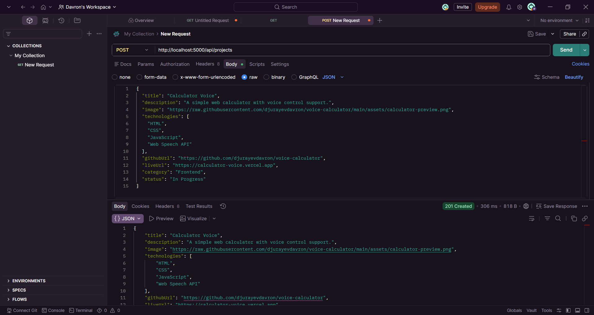
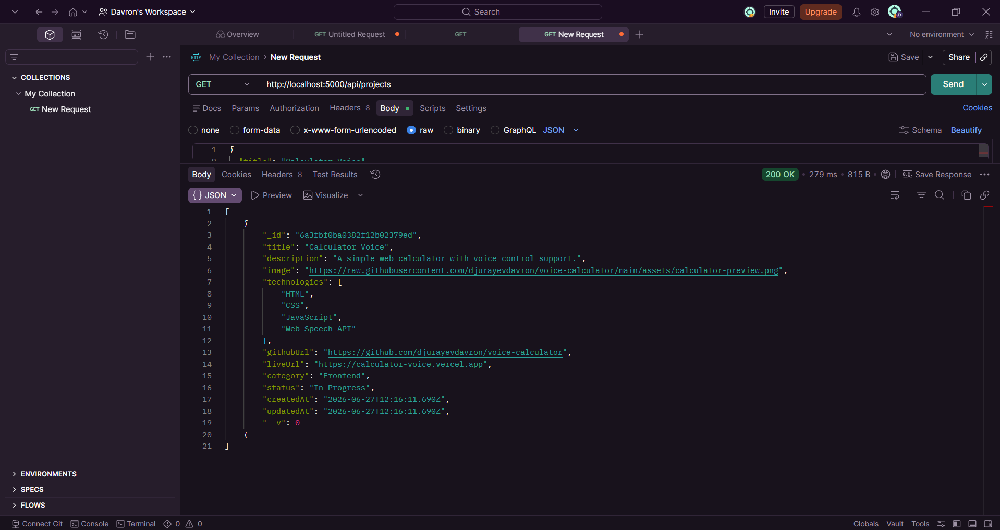
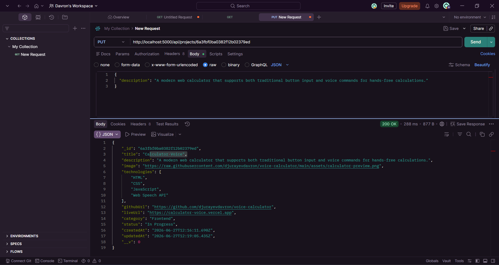
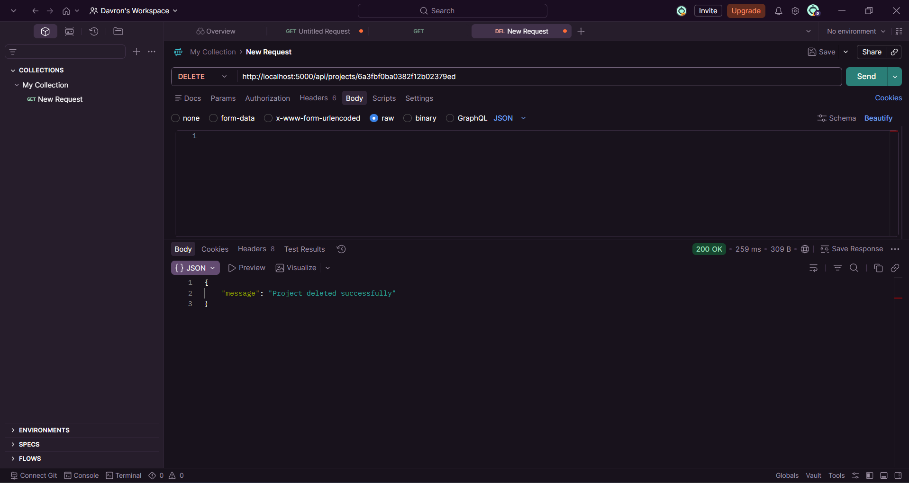
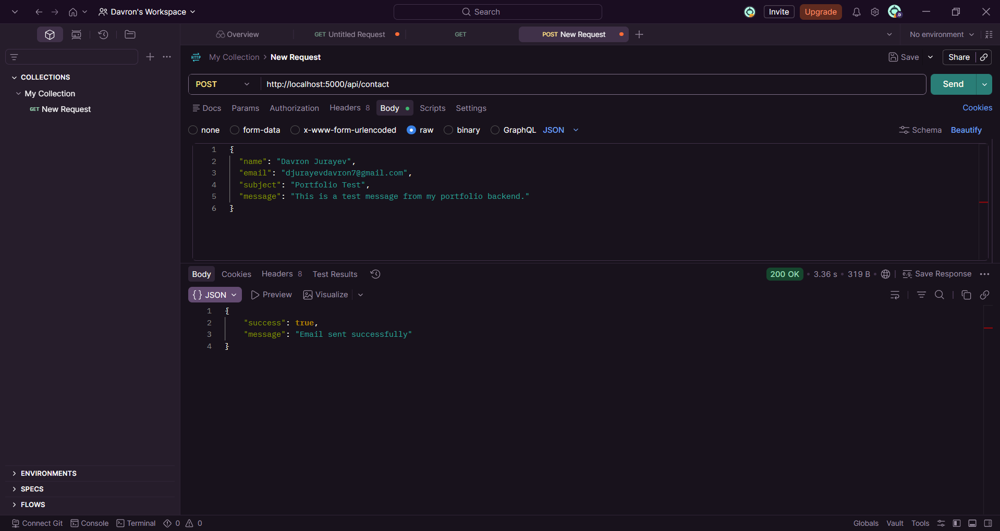
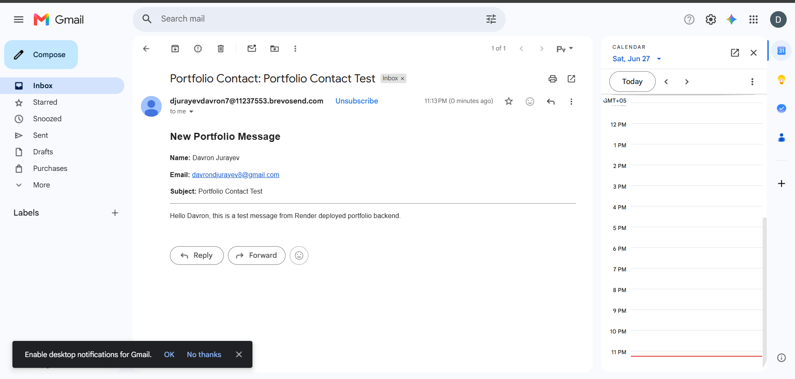

# Portfolio Backend API

REST API for managing portfolio projects and contact messages | Portfolio loyihalarini va aloqa xabarlarini boshqarish uchun REST API.

## Features | Imkoniyatlar

* Create new projects | Yangi loyihalar qo'shish
* Get all projects | Barcha loyihalarni olish
* Get project by ID | Loyihani ID orqali olish
* Update existing projects | Mavjud loyihalarni yangilash
* Delete projects | Loyihalarni o'chirish
* Send contact messages directly to email using Brevo SMTP | Brevo SMTP orqali email yuborish
* MongoDB database integration | MongoDB ma'lumotlar bazasi integratsiyasi
* Environment variables support | Muhit o'zgaruvchilari qo'llab-quvvatlanadi

## Technologies | Texnologiyalar

* Node.js
* Express.js
* MongoDB
* Mongoose
* Nodemailer
* Brevo SMTP
* Dotenv
* CORS

## Project Structure | Loyiha tuzilishi

```text
src/
├── config/
├── controllers/
├── middleware/
├── models/
├── routes/
├── app.js
└── server.js
```

## API Endpoints | API manzillari

| Method | Endpoint          | Description                    | Tavsif                        |
| ------ | ----------------- | ------------------------------ | ----------------------------- |
| GET    | /api/projects     | Get all projects               | Barcha loyihalarni olish      |
| GET    | /api/projects/:id | Get project by ID              | Loyihani ID orqali olish      |
| POST   | /api/projects     | Create new project             | Yangi loyiha yaratish         |
| PUT    | /api/projects/:id | Update project                 | Loyihani yangilash            |
| DELETE | /api/projects/:id | Delete project                 | Loyihani o'chirish            |
| POST   | /api/contact      | Send contact message via email | Xabarni email orqali yuborish |

## API Testing Screenshots | API test rasmlari

### Create Project | Loyiha yaratish



### Get All Projects | Barcha loyihalarni olish



### Update Project | Loyihani yangilash



### Delete Project | Loyihani o'chirish



### Contact API Success | Contact API muvaffaqiyatli javobi



### Email Notification | Email xabari



## Installation | O'rnatish

```bash
npm install
```

## Run Project | Loyihani ishga tushirish

```bash
npm start
```

## Environment Variables | Muhit o'zgaruvchilari

Create a `.env` file and add the following variables | `.env` fayl yarating va quyidagi o'zgaruvchilarni qo'shing:

```env
PORT=5000
MONGO_URI=your_mongodb_connection_string

SMTP_HOST=smtp-relay.brevo.com
SMTP_PORT=2525
SMTP_EMAIL=your_brevo_smtp_login
SMTP_PASSWORD=your_brevo_smtp_password
SENDER_EMAIL=your_verified_sender_email
```

## Author | Muallif

Davron Jurayev
